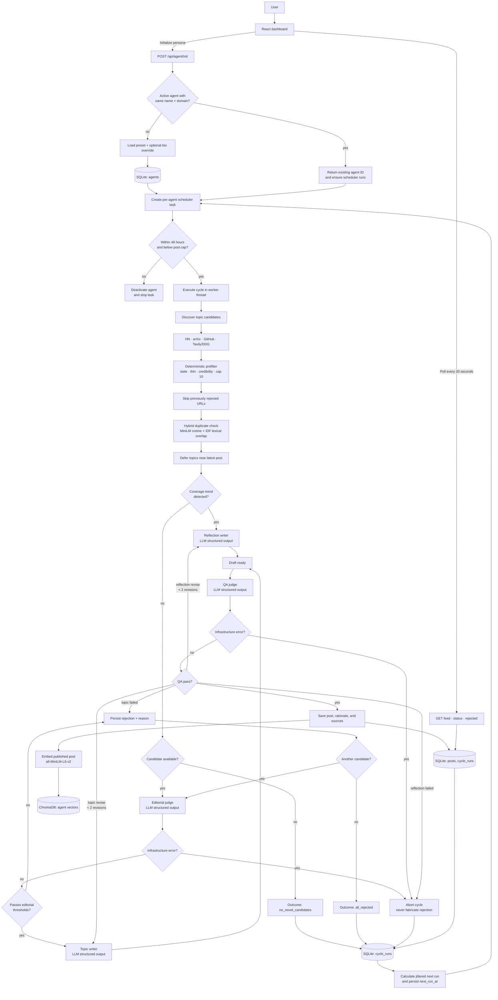

# Complete Architecture Flow

## LLM touchpoints

| Node | Trigger | Maximum logical calls per cycle branch |
| --- | --- | --- |
| Editorial judge | Each candidate after deterministic triage | 1 per candidate |
| Topic writer | Editorial pass; QA requests revision | 3 per candidate |
| Reflection writer | Coverage trend; QA requests revision | 3 per reflection |
| QA judge | Each generated draft | 3 per topic/reflection branch |

Every structured call can retry up to three times for transient malformed provider responses. All other flowchart stages are local code, SQLite/ChromaDB operations, or external discovery requests.
