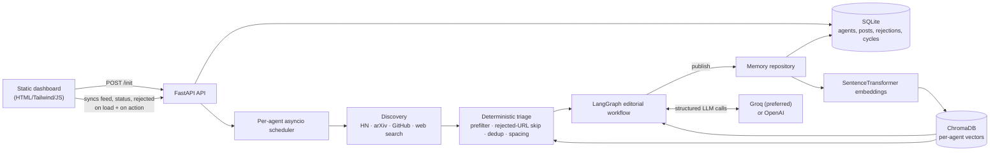
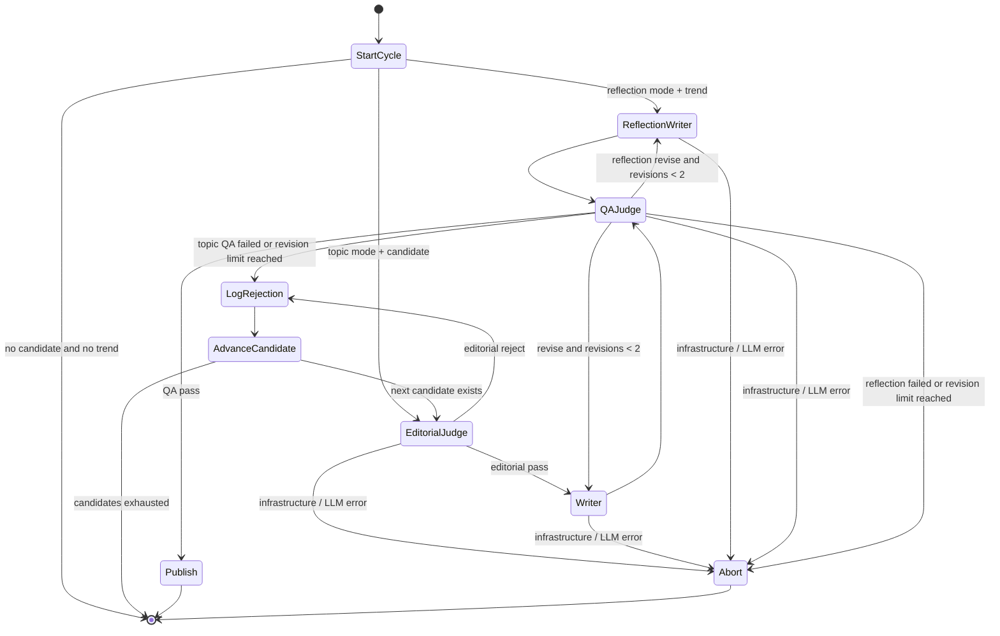
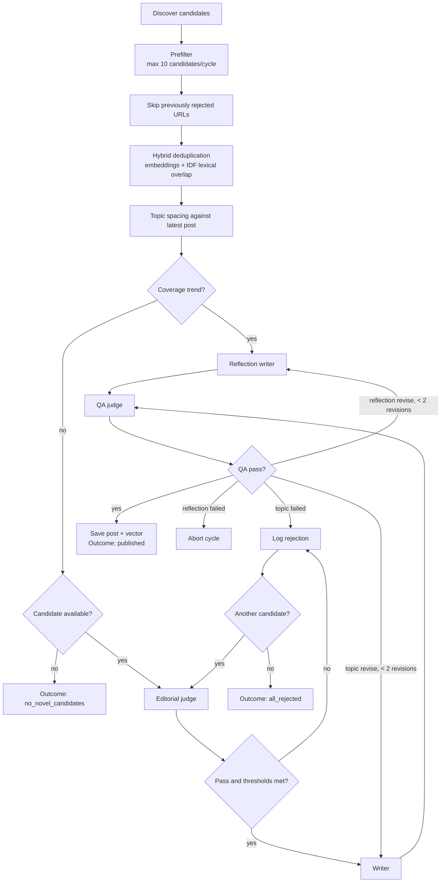

<div align="center">

# 🤖 Autonomous AI Persona Agent

**An autonomous publishing system that finds AI research and engineering stories, applies a persona-specific editorial bar, writes an original LinkedIn post, quality-checks it, and persists both published and rejected decisions.**

[](#project-structure)
[](#-cycle-state-graph)
[](#-memory--data-model)
[](#-memory--data-model)
[](#-llm-call-architecture)
[](#api--frontend-contract)
[](#4-run-tests)

*The system is intentionally selective — **a cycle may publish nothing.***

</div>

> 💬 *"Distill is an AI research translator that publishes only when it has found the real story inside a paper — not just its highest number."*

---

## 📑 Table of Contents

- [System at a Glance](#-system-at-a-glance)
- [Complete Lifecycle](#-complete-lifecycle)
- [Cycle State Graph](#-cycle-state-graph)
  - [Topic-Cycle Routing](#topic-cycle-routing)
- [LLM Call Architecture](#-llm-call-architecture)
  - [Failure Semantics](#failure-semantics)
- [Memory & Data Model](#-memory--data-model)
- [API & Frontend Contract](#-api--frontend-contract)
- [Project Structure](#-project-structure)
- [Quick Start](#-quick-start)
- [Related Docs](#-related-docs)

---

## 🧭 System at a Glance

The **React dashboard** initializes an agent and reads its audit trail. **FastAPI** owns the durable agent record and starts one background scheduler task per active agent. Each scheduled cycle discovers possible topics, filters and de-duplicates them using deterministic logic and long-term memory, then runs the **LangGraph editorial workflow**. LLM calls are confined to the editorial judge, writer / reflection-writer, and QA nodes.

> 📄 For a single end-to-end diagram from dashboard initialization through scheduling, publishing, persistence, and polling, see **[ARCHITECTURE_FLOW.md](ARCHITECTURE_FLOW.md)**.



<details>
<summary><strong>🔎 How to read this diagram</strong></summary>

- **UI → API**: the dashboard is a thin client — it never talks to an LLM or a database directly.
- **API → Scheduler**: one asyncio task is spun up per *active* agent, decoupled from the request/response cycle.
- **Discovery → Triage → Graph**: cheap, deterministic filtering happens *before* any LLM is invoked, keeping cost and noise low.
- **Graph ↔ Memory ↔ ChromaDB**: published posts feed back into memory, which future cycles use for deduplication and few-shot retrieval.

</details>

---

## 🔄 Complete Lifecycle

| # | Stage | What happens |
|---|-------|---------------|
| 1 | **Application startup** | Initializes SQLite, performs a small structured-output LLM health check, exposes it via `GET /health`, and re-arms a scheduler task for every active agent found in SQLite. |
| 2 | **Agent initialization** | The dashboard submits a persona name and domain to `POST /api/agent/init`. The API matches a persona preset (with an optional bio override), saves the immutable persona JSON, chooses a jittered first run, and starts the scheduler. Repeating the same active name/domain is **idempotent** and returns the existing agent. |
| 3 | **Scheduler** | Waits until the next run, enforces the 48-hour lifespan and post cap, executes a cycle in a worker thread, records the next scheduled time, and repeats. An unexpected scheduler error waits **five minutes** before retrying. |
| 4 | **Discovery & deterministic selection** | Combines candidates from Hacker News, arXiv, GitHub Search, and web search (Tavily when configured, DuckDuckGo otherwise). A source failure does not stop other sources. |
| 5 | **Memory-aware triage** | Removes stale, thin, low-credibility, already-rejected, and duplicate candidates; then orders close-to-the-last-post subjects later to improve feed variety. **No LLM call** is used here. |
| 6 | **Editorial graph** | Evaluates candidates one at a time. Records every editorial or QA rejection and advances to the next candidate until one post is published or candidates are exhausted. A detected coverage trend can instead trigger a **reflection post** about the agent's own recent work. |
| 7 | **Persistence & display** | Saves a passing post to SQLite and ChromaDB. The dashboard polls read-only endpoints to show posts, next run, cycle count, and rejected-topic reasons. |

---

## 🌐 Cycle State Graph

`AgentState` carries the persona, candidate list and pointer, current candidate, judge/draft/QA outputs, revision count, error state, publication result, rejection audit items, and optional reflection trend through the compiled LangGraph workflow.



### Topic-Cycle Routing



<details>
<summary><strong>🧠 Why two writer paths?</strong></summary>

The **Writer** node handles ordinary topic candidates sourced from discovery. The **Reflection Writer** is triggered instead when deterministic trend detection finds enough related recent posts — letting the persona comment on its own body of work rather than always chasing new external sources. Both converge on the same **QA Judge**, so voice and quality standards stay consistent regardless of path.

</details>

---

## 🧩 LLM Call Architecture

All model calls use LangChain `ChatOpenAI` with **Pydantic structured output**. The provider is selected at runtime: a valid `GROQ_API_KEY` takes precedence; otherwise `OPENAI_API_KEY` is used. Defaults are `llama-3.3-70b-versatile` for Groq and `gpt-4o-mini` for OpenAI, unless `LLM_MODEL` overrides them. Models without native JSON-schema support use function calling. **Each structured call retries up to three times** for transient malformed structured responses.

| Stage | Invocation | Input context | Structured result | Deterministic guard / route |
|---|---|---|---|---|
| **Startup health** | 1 small call | `ping` | `LLMCheck { ok }` | Sets `/health` `canPublish`; startup continues but cycles will fail closed if unavailable. |
| **Editorial judge** | 1 per evaluated topic | Persona, thresholds, candidate metadata, 8 recent titles | `JudgeVerdict` scores + decision + reason | Code overrides a model `pass` if any persona threshold is missed. |
| **Writer** | 1 initial draft + up to 2 revisions | Persona voice, approved source, judge rationale, QA feedback on revision, up to 2 hybrid-retrieved prior posts | `DraftPost` text + selection / timing rationale | Separates a required closing line deterministically. |
| **Reflection writer** | 1 initial draft + up to 2 revisions | Persona voice, deterministically detected related post titles, QA feedback | `DraftPost` | Used only in reflection mode; no candidate discovery source is invented. |
| **QA judge** | 1 per draft attempt | Draft, source summary (or prior titles for a reflection), 4 recent full posts, voice rules | `QAVerdict` voice / grounding / repetition flags + pass/revise feedback | Code forces `revise` for forbidden phrases, lifted example wording, or missing required closing line. |

> ⚡ A normal topic candidate uses **1–7 logical LLM calls**: judge + one to three writer calls + one to three QA calls.
> A reflection uses **2–6 logical calls** (writer and QA only). Retry attempts can increase provider requests up to threefold.
> Discovery, prefiltering, deduplication, trend detection, rejection logging, and publishing are all **deterministic/local** operations.

### Failure Semantics

- 🔴 An LLM, rate-limit, or infrastructure failure sets `node_error` and routes to `abort_cycle`; it is **never** written as an editorial rejection.
- 🔴 QA **fails closed**: an unavailable QA response cannot publish a draft.
- 🟡 A topic that still fails QA after two revisions is logged as a QA rejection and the graph tries the next candidate.
- 🟡 A reflection that still fails QA after two revisions is **abandoned** — it has no next topic candidate.
- 🟢 Discovery-source failures are isolated; the cycle can proceed with candidates from the remaining sources.
- 📝 Every cycle writes a `cycle_runs` audit record with outcome and raw candidate count, **including failures**.

---

## 🗃 Memory & Data Model

SQLite is the source of record, while ChromaDB stores semantic vectors for published posts. **Both are partitioned by agent ID.**

| Store | Records | Used for |
|---|---|---|
| SQLite `agents` | Persona JSON, schedule, active flag, cycle count | Scheduler recovery and API status |
| SQLite `posts` | Published text, rationale, sources, topic title, kind | Feed, audit, recent-post context, reflection pacing |
| SQLite `rejected_topics` | Topic, URL, reason, score payload | Rejection audit and skipping repeat re-evaluation |
| SQLite `cycle_runs` | Timing, outcome, discovered count | Operational history |
| ChromaDB `agent_<id>` | `all-MiniLM-L6-v2` post embeddings | Dense duplicate detection and writer few-shot retrieval |
| In-process BM25 | Tokenized SQLite posts | Sparse counterpart to dense retrieval; fused with reciprocal-rank fusion |

<details>
<summary><strong>🔬 Duplicate detection details</strong></summary>

The hybrid duplicate check accepts an **exact semantic match** on its own, but requires **both** semantic similarity **and** high IDF-weighted lexical overlap for borderline matches. This avoids treating every post from the same subfield as a duplicate.

Reflection detection is also deterministic: after enough history, it finds a sufficiently large related group among recent post embeddings and spaces reflection posts apart.

</details>

---

## 🔌 API & Frontend Contract

| Endpoint | Purpose | LLM calls |
|---|---|---|
| `POST /api/agent/init` | Create or resume an active persona agent and launch/reuse its scheduler | None during request; later cycles call the model |
| `GET /api/agent/feed?agentId=…` | Return newest-first published posts | None |
| `GET /api/agent/status?agentId=…` | Return agent lifecycle and next scheduled time | None |
| `GET /api/agent/rejected?agentId=…` | Return rejection audit log | None |
| `GET /health` | Return service and structured-output LLM readiness | None during request |

The static dashboard (`frontend1/ada-desk`) stores the backend agent ID in `localStorage` (`ada_backend_agent_id`), via `assets/js/agent-api.js`. It syncs feed, status, and rejected topics **once on page load**, and again after any action that changes state — initiating a cycle, or the manual refresh/fetch buttons on each page. A missing agent (usually after a database reset) surfaces as a failed sync and returns the user to initialization.

---

## 📁 Project Structure

```text
├── backend/
│   ├── app/
│   │   ├── api/       # FastAPI routes and request/response schemas
│   │   ├── core/      # Settings and the persistent per-agent scheduler
│   │   ├── agent/     # LangGraph state machine, LLM factory, prompts,
│   │   │               persona rules, nodes, and discovery tools
│   │   └── memory/     # SQLAlchemy models, SQLite repository, embeddings,
│   │                     ChromaDB, hybrid retrieval, reflection detection
│   └── tests/         # API, graph, and scheduling contract tests
├── frontend1/
│   └── ada-desk/       # ✅ Active dashboard — static HTML/Tailwind/vanilla JS,
│                          served by server.js. Backend calls in assets/js/agent-api.js
├── frontend/            # ⚠️ Legacy Vite + React prototype (reference only, unused)
├── walkthrough.md       # Live-data/API-key, scheduling, restart & verification guide
└── persona-distill.md   # Persona identity, voice, editorial standards, memory behavior
```

---

## 🚀 Quick Start

<details open>
<summary><strong>1️⃣ Configure and install</strong></summary>

```powershell
py -m venv .venv
.\.venv\Scripts\Activate.ps1
py -m pip install -r requirements.txt
Copy-Item .env.example .env
```

Set either `GROQ_API_KEY` or `OPENAI_API_KEY` in `.env`. `TAVILY_API_KEY` is optional — without it, web discovery falls back to DuckDuckGo. The first embedding use loads `sentence-transformers/all-MiniLM-L6-v2`.

</details>

<details open>
<summary><strong>2️⃣ Start the API</strong></summary>

```powershell
py -m uvicorn backend.app.main:app --host 127.0.0.1 --port 8000 --reload
```

Check `http://127.0.0.1:8000/health` — `canPublish` should be `true` before expecting published posts.

</details>

<details open>
<summary><strong>3️⃣ Start the dashboard</strong></summary>

```powershell
cd frontend1\ada-desk
npm start
```

Open `http://localhost:5173`. It calls the backend at `http://127.0.0.1:8000/api` by default; the FastAPI server must be running on **port 8000** (8000 is reserved for the backend, 5173 for the dashboard). To point it at a different backend or set an API key, edit `baseUrl` / `apiKey` in `assets/js/agent-api.js`.

> 💡 No build step is required — it's static HTML/CSS/JS. You can also open `index.html` directly or serve the folder with any static file server.

</details>

<details open>
<summary><strong>4️⃣ Run tests</strong></summary>

```powershell
py -m pytest backend/tests -v
```

</details>

> ⚙️ **Ports at a glance** — Backend: `8000` · Dashboard: `5173`

---

## 📚 Related Docs

| Doc | Contents |
|---|---|
| [`ARCHITECTURE_FLOW.md`](ARCHITECTURE_FLOW.md) | End-to-end diagram: dashboard init → scheduling → publishing → persistence → polling |
| [`walkthrough.md`](walkthrough.md) | Live-data/API-key setup, cadence overrides, restarts, and verification |
| [`persona-distill.md`](persona-distill.md) | Persona identity, voice, editorial standards, and memory behavior |