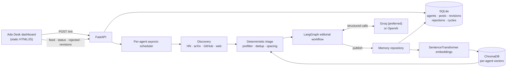

# Autonomous AI Persona Agent

An agent that finds AI research and engineering stories, judges them against a persona's editorial bar, writes a LinkedIn post, quality-checks it, and records both what it published and what it turned down.

The system is deliberately selective. A cycle can end without publishing anything, and every rejection is logged with the scores behind it.

---

## Contents

- [What it does](#what-it-does)
- [Architecture](#architecture)
- [Run it locally](#run-it-locally)
- [Environment variables](#environment-variables)
- [API](#api)
- [Deploying to Render](#deploying-to-render)
- [Project status](#project-status) — **what works, what's broken, what's left**
- [Known problems](#known-problems)
- [What to build next](#what-to-build-next)
- [Repository layout](#repository-layout)

---

## What it does

One **cycle** runs like this:

1. **Discover** — pulls candidate stories from Hacker News, arXiv, GitHub Search, and web search (Tavily if configured, DuckDuckGo otherwise). One source failing doesn't stop the others.
2. **Triage** — deterministic filters remove stale, thin, low-credibility, previously-rejected and duplicate candidates, then reorder what's left so subjects close to the last post come later. No LLM calls here.
3. **Judge** — the editorial judge scores one candidate at a time against the persona's thresholds. Rejections are recorded with their scores.
4. **Write** — the writer drafts the post in the persona's voice, ending with 3–5 topic hashtags. It picks a shape for this post from the persona's weighted mix (explainer, observation, question, lesson, contrarian), writes `WRITER_DRAFT_ATTEMPTS` drafts from different angles, and keeps whichever scores best against the persona's own deterministic rules.
5. **QA** — deterministic rules (forbidden phrases, sentence length, word count, no em-dashes, no closing takeaway) plus model checks for grounding, repetition and single-idea focus. Failing sends the draft back for revision, up to 3 times.
6. **Brand-safety check** — a deterministic pass for unhedged claims about named companies or people. Findings are attached to the post for the reviewer rather than blocking it, since naming a company while describing its published work is perfectly legitimate.
7. **Save as a draft** — a passing post is written to SQLite with status `pending` and embedded into ChromaDB, so future cycles can tell the topic is already in hand.
8. **Review** — you approve or reject it in the dashboard. **Nothing is published on the model's judgement alone**, since posts go out under a real person's name.

If the agent notices a pattern in its own recent coverage, it can instead write a **reflection** post about that, rather than a new source.

At any point you can give **feedback** on a post ("make it punchier", "emphasise the practical takeaway") and the reframer rewrites it. **Every version is kept** — open *View All Drafts* to see each draft, the feedback that produced it, and restore any earlier one.

Approval is what makes a post real, and it decides more than visibility:

| | Pending | Approved | Rejected |
|---|---|---|---|
| Counts toward `MAX_POSTS_48H` | no | **yes** | no |
| Used as a voice example for future posts | no | **yes** | no |
| Checked against for repetition | no | **yes** | no |
| Blocks the topic from being drafted again | **yes** | **yes** | no |

So an unreviewed draft — including one shaped by whatever someone typed into the feedback box — cannot influence what the agent writes next until a human has agreed it was any good. Rejecting a post keeps it on record but releases its topic for a future cycle.

**Personas** are presets (`Distill`, `Ada`) defining domain, voice, forbidden phrases, word bounds, judge thresholds, posting cadence, discovery sources and post-type mix. The persona chosen at setup is frozen with the agent.

Each preset ships **voice samples** — three complete posts demonstrating how it writes. Models match a voice from examples far more reliably than from adjectives, so these matter more than the tone description does. At setup you can paste two or three of **your own** posts instead, under "Write in your own voice"; those replace the preset's, since your writing describes your voice better than anything hand-written could.

**Discovery sources are part of the persona too.** A persona outside AI research can be pointed at its own RSS feeds and search terms rather than being stuck with Hacker News and arXiv.

---

## Architecture



**One service, one port.** FastAPI serves both the API (`/api/...`) and the dashboard (`/`) from the same process — the Dockerfile copies `frontend1/ada-desk` into the image and `main.py` mounts it as static files. There is no separate frontend server in the deployed setup.

**Scheduling** is one `asyncio` task per active agent, sleeping between cycles and executing each cycle in a worker thread. Cycles are bounded by a 48-hour window and a post cap.

---

## Run it locally

**Requirements:** Python 3.10+ / 3.11 and Node.js 18+.

### 1. Setup Environment & Backend
```powershell
# 1. Create and activate a virtual environment
python -m venv .venv
.venv\Scripts\Activate.ps1

# 2. Install backend dependencies
python -m pip install -r requirements.txt

# 3. Configure API keys (.env)
Copy-Item .env.example .env
notepad .env     # Add your GROQ_API_KEY (or OPENAI_API_KEY)
```

### 2. Start the Servers

#### Terminal 1 — Backend (FastAPI on Port 8000)
```powershell
python -m uvicorn backend.app.main:app --host 127.0.0.1 --port 8000 --reload
```

#### Terminal 2 — Frontend (Distill Desk on Port 5173)
```powershell
node frontend1/ada-desk/server.js
```

### 3. Open the App in Your Browser

Open: **[http://localhost:5173/](http://localhost:5173/)**

#### 🚀 User Journey:
1. **Hero Landing Page (`welcome.html`)**: First page visitors see introducing Distill and its autonomous AI research pipeline.
2. **Persona Onboarding (`onboarding.html`)**: Click *"Configure Your Agent Persona"* to specify your **Agent / Author Name** and **AI Domain Focus** (e.g. *AI Agents*, *LLM Alignment*, *Computer Vision*, *Robotics*, or a *Custom AI subfield*).
3. **Main Dashboard (`index.html`)**: Autonomous research feeds start scanning matching topics, judging technical mechanisms, drafting posts, and enabling 1-click LinkedIn Unicode bold copying.

### Tests:
```powershell
python -m pytest backend/tests -v
```

---

## Environment variables

| Variable | Required | Default | Notes |
|---|---|---|---|
| `GROQ_API_KEY` | **Yes** (or OpenAI) | — | Preferred. Get one at console.groq.com/keys. |
| `OPENAI_API_KEY` | Only if no Groq key | — | Fallback provider. |
| `TAVILY_API_KEY` | No | — | Without it, web discovery uses DuckDuckGo. |
| `LLM_MODEL` | No | `openai/gpt-oss-120b` | Must support structured output. This is a *Groq-hosted* model despite the name. |
| `LLM_FALLBACK_MODELS` | No | `llama-3.3-70b-versatile,openai/gpt-oss-20b` | Tried in order when the primary is rate limited. Empty disables fallback. |
| `LLM_TIMEOUT_SECONDS` | No | `90` | Per request. |
| `LLM_CALL_DELAY_SECONDS` | No | `1.0` | Pause before every model call, to avoid tripping per-minute limits. |
| `DATABASE_URL` | No | `sqlite:///./post_generator.db` | See the ephemeral-storage warning below. |
| `FRONTEND_DIR` | No | `/app/frontend` | Where the dashboard's static files live. Set it locally to `frontend1/ada-desk`. |
| `ENVIRONMENT` | No | `development` | Set to `production` when deployed. |
| `LOG_LEVEL` | No | `INFO` | |
| `CADENCE_MIN_HOURS` / `CADENCE_MAX_HOURS` | No | `2.0` / `5.0` | Used only when the persona defines no cadence. |
| `CADENCE_OVERRIDE_MIN_HOURS` / `..._MAX_HOURS` | No | unset | Demo override — makes a full loop observable in minutes. |
| `MAX_POSTS_48H` | No | `16` | Safety cap. Counts approved posts in the current window. |
| `WRITER_DRAFT_ATTEMPTS` | No | `2` | Drafts written per topic, best kept. Costs this many writer calls per topic; set to `1` when quota is tight. |
| `BRAND_SAFETY_ENABLED` | No | `true` | Flags unhedged claims about named parties for the reviewer. |
| `HOST` / `PORT` | No | `0.0.0.0` / `8000` | The Dockerfile hardcodes these; setting them has no effect on Render. |

**Placeholders count as missing.** `GROQ_API_KEY=your_groq_api_key_here` is explicitly rejected, and the startup check reports "No LLM API key provided" rather than an auth error.

---

## API

Base path `/api/agent`. **No authentication** — see [Known problems](#known-problems).

| Method | Path | Purpose |
|---|---|---|
| `POST` | `/init` | Create or reactivate an agent from `{persona: {name, domain, bio?}}`. Starts its scheduler. |
| `GET` | `/feed?agentId=&postStatus=` | Posts, newest first. `postStatus` filters by review state (`pending`, `approved`, `rejected`, `posted`; comma-separated). Also returns `pendingCount`. |
| `GET` | `/status?agentId=` | Agent state, next run, cycle count. Omitting `agentId` returns **all** agents. |
| `GET` | `/activity?agentId=` | Live progress of the currently executing cycle. |
| `GET` | `/rejected?agentId=` | Rejected topics with reasons and judge scores. Omitting `agentId` returns **all** agents'. |
| `POST` | `/reframe` | Rewrite a post from human feedback: `{postId, feedback}`. Keeps the old version. |
| `GET` | `/post/{postId}/revisions` | Every saved version, oldest first, with the feedback behind each. |
| `POST` | `/post/{postId}/restore` | Make an earlier version current: `{version}`. Appends a new version rather than deleting. |
| `POST` | `/post/{postId}/approve` | Accept a draft — this is what publishes it. Optional `{note}`. |
| `POST` | `/post/{postId}/reject` | Turn a draft down. Kept on record, excluded from memory. Optional `{note}`. |

Also: `GET /health` (service + LLM status), `GET /docs` (interactive API docs), `GET /` (the dashboard).

---

## Deploying to Render

Deploys as a **single Docker web service** — no separate frontend service needed.

1. New → Web Service → connect this repo → Runtime **Docker**
2. Add environment variables: `GROQ_API_KEY`, `TAVILY_API_KEY`, `ENVIRONMENT=production`. Leave the rest on defaults.
3. Deploy. Don't set `PORT` — the Dockerfile hardcodes 8000 and Render detects it from `EXPOSE`.
4. Check `/health` → `canPublish: true`.

**Free tier realities, all of which are real and currently unaddressed:**

- **512MB RAM.** The Dockerfile installs the CPU-only torch wheel and caps thread pools specifically to fit. It's still tight — expect occasional OOM restarts.
- **Ephemeral disk.** SQLite and ChromaDB both write to container-local paths, so **every deploy or restart wipes all posts and history.** Attach a persistent disk and point `DATABASE_URL` at it for anything you want to keep.
- **The service sleeps** after ~15 minutes idle. Since cycles are driven by in-process timers, the agent effectively only runs when a request wakes the container. It is not meaningfully autonomous on this tier.
- **Slow builds** (torch is most of it), and a build log warning about `pip` running as root, which is normal in Docker and safe to ignore.

---

## Project status

### Working

Discovery · deterministic triage and dedup · the LangGraph editorial pipeline · persona presets · SQLite + ChromaDB persistence · the dashboard · **human approval before anything publishes** · reframing from human feedback · draft history with restore · CI running the test suite on every push · single-service Docker deploy.

### Not built yet

| Gap | Consequence |
|---|---|
| **Nothing reaches LinkedIn** | Approving a post marks it approved in the database; it is not sent anywhere. The loop is not closed. |
| **No engagement feedback** | The agent never learns whether anything worked. Its judgement is frozen at whatever the prompts encode. |
| **No agent lifecycle** | No delete, pause, resume or reset. Agents accumulate permanently. |
| **No cost tracking** | ~10 LLM calls per cycle, none recorded. |
| **Unused data** | `cycle_runs` and `rejected_topics.judge_scores_json` have been collecting since day one and are displayed nowhere. |

---

## Known problems

Ordered by severity. These are real, reproducible, and unfixed at time of writing.

### Recently fixed

Three critical bugs were resolved and are covered by tests:

- **`AgentState` was missing `evaluated_candidates` and `forced_publish`.** LangGraph discards writes to undeclared channels, so the "publish the best near-miss rather than nothing" fallback could never fire. `backend/tests/test_graph_e2e.py` now asserts the schema directly and drives the fallback end to end.
- **The startup LLM check blocked before the port was bound.** It now runs off the event loop with a 20-second cap, so a slow provider produces a service that starts and reports the fault on `/health` rather than a deploy that appears to hang.
- **`_build_structured` called `get_llm()`**, which can return a fallback wrapper exposing neither `.model_name` nor `.with_structured_output`. It uses the raw client directly now, which also stops fallbacks being nested two deep.

### Correctness

- **Concurrent cycles.** `trigger_agent_now` cancels the coroutine but not the worker thread running the cycle, then starts a new one — double-clicking "Initiate Cycle" runs two cycles on one agent.
- **`save_post` commits before writing the vector.** A ChromaDB failure leaves a published post with no embedding, which dedup can never match, so the topic gets republished.
- **The cycle's `finally` block** reports inactive cycles as failures, and reuses a session that may need a rollback — losing the audit row for exactly the failures you want to see.
- **Force-published posts bypass QA** and stay in the Rejected list, so the same title appears on both pages.
- **The dedup fallback republishes known duplicates** when triage drops everything.
- **Unguarded lazy singletons** for the embedding model and Chroma client — two concurrent first-cycles can load two copies of the model, which on 512MB is fatal.
- **Reframing still bypasses QA.** Feedback like "make it longer, add a takeaway" produces text the QA judge would have hard-rejected — though it now lands in a draft a human must approve, rather than going straight out.
- **Hashtags count toward the word limit.** The writer targets 180 words, appends hashtags, exceeds 180, and QA forces a revision — burning revisions on an artefact. Reflection posts never got the hashtag instruction at all, so they publish without any.

### Security

- **No authentication anywhere**, and CORS is `*` with credentials. `POST /init` spawns a permanent background loop, so anyone can create unlimited agents with no way to delete them.
- **`/reframe` is unauthenticated and uncapped.** Each call costs an LLM invocation on the same quota the agent uses; `feedback` has no length limit and no ownership check.
- **Prompt injection is contained but not prevented.** Feedback text still goes into the post, but only *approved* posts feed the writer's few-shot context and the QA repetition corpus, so injected content cannot influence future posts unless a human approves it first.
- **Raw provider errors** (model name, endpoint, quota) are returned to anonymous callers and rendered via `innerHTML`.
- **Unbounded reads.** `/feed`, `/rejected` and `/status` have no limits, and the latter two return every agent's data when `agentId` is omitted.

### Dashboard

- Returning visitors who loaded the dashboard before the API URL changed are permanently pinned to `localhost` by cached `localStorage`, and see stale demo metrics as if live.
- The live feed never renders — `main.js` calls a `getFeedLines()` method that doesn't exist.
- Rejected Topics shows other agents' rejections under the current persona's name.
- "Copy Post Text" copies HTML entities (`&quot;`, `&amp;`) instead of clean text.
- Nothing polls, so results never appear until a manual reload.
- Several controls (`#spike-filter`, `#load-previous`, the "Execution Mode" toggle) have no handlers at all. (The Published page's filter now works — it filters by review status.)
- `agent-engine.js` still contains client-side simulation code writing fake cycles into the same `localStorage` the real sync uses.
- The API playground's reframe demo permanently rewrites your newest real post.

### Deployment

- All data on ephemeral disk (above). If only the Chroma directory is lost, dedup silently degrades to "nothing is a duplicate".
- The embedding model downloads at runtime on every cold start; `HF_HOME` isn't set.
- Shutdown never drains the executor, so SIGTERM can land mid-write.
- Dependencies are unpinned `>=` ranges with no lockfile — `chromadb` and `langgraph` have both shipped breaking majors above these floors.

---

## What to build next

Roughly in the order that gives the most value.

### 1. Fix what's left

The three critical bugs are fixed and CI now runs the suite on every push. The next tier is the correctness list above — the per-agent cycle lock, embedding before commit, the rollback in the cycle's `finally` — then **auth**, which should land before this URL is shared with anyone.

### 2. Finish the review flow

Approval exists; three things would make it good:

- **Run QA on reframed text.** Reframing still skips the deterministic checks. Now that reframes land in a draft rather than over a published post the blast radius is small, but a post can still be approved with em-dashes and a closing takeaway the QA judge would have rejected.
- **Feedback presets** — *Shorter · Punchier · More technical · Add an example* — instead of a free-text box. Faster to use, and it closes most of the prompt-injection surface as a side effect.
- **Notify when something needs review.** A queue nobody is told about is just a queue. Email, Slack or a webhook on `pending`.

### 3. Measure prompt changes

An eval harness now exists but has no baseline. Before the next prompt change, run it
and keep the result:

```powershell
python -m backend.evals.run_eval --save baseline.json
# ...change a prompt...
python -m backend.evals.run_eval --compare baseline.json
```

It runs ten frozen candidates through the editorial judge and reports which decisions
moved. Cases sit near the boundary on purpose: a set of obvious accepts and obvious
rejects agrees with itself under any prompt and measures nothing. It makes real model
calls, so it is not part of CI.

Still worth adding: **prompt versioning**, so a post records which prompt wrote it.

### 4. Make it actually autonomous

The agent currently isn't, in any meaningful sense — the free instance sleeps, and in-process timers die with it.

- **Move scheduling out of the process.** An external cron or uptime pinger hitting a trigger endpoint is the cheap fix; a real job queue (Celery/RQ + Redis) is the durable one, and also survives restarts and scales past one process.
- **Measure the 48-hour window in cycles elapsed**, not wall-clock, so a sleeping instance doesn't burn its budget doing nothing.
- **Notify on publish** (email, Slack, webhook). An agent that publishes every 2–3 hours into a dashboard nobody watches may as well not have.
- **Per-stage cycle progress**, so a running cycle isn't a black box.
- **Confidence-gated auto-publish** once approval exists — auto-publish above a threshold, queue the rest, and dial autonomy up as trust builds instead of choosing all-or-nothing.

### 5. Close the loop

- **Post to LinkedIn** (`w_member_social` + `POST /ugcPosts`). Needs app review, which takes weeks — **start that application early even though this ships late.** A copy-to-clipboard button covers the gap.
- **Pull engagement data** and feed it into the judge and writer prompts. This is what finally makes the memory system earn its keep; today ChromaDB only does deduplication.
- **Learn from approve/reject/edit decisions** — the signal that makes the agent feel like *yours* after a week rather than a generic writer.
- **Link strategy** (LinkedIn suppresses posts with body links; the convention is the link in the first comment) and **a generated visual**, which measurably increases reach.

### 6. Surface what you already collect

`cycle_runs` and `rejected_topics.judge_scores_json` answer the most important tuning question in the system — *is the editorial bar too strict?* — and nothing displays them. A performance page showing publish rate, outcome mix over time, and score distributions for accepted vs rejected is cheap and immediately useful.

### 7. Harden the deployment

Replace `sentence-transformers`/`torch` with **`fastembed`** (ONNX, ~50MB, same model) — that alone takes the free tier from borderline to comfortable and cuts build time. Then a **persistent disk**, a **`render.yaml`** blueprint, **structured logging + Sentry**, and **pinned dependencies**.

---

## Repository layout

```
backend/app/
  main.py              FastAPI app, lifespan, static mount for the dashboard
  api/routes.py        All HTTP endpoints
  core/
    config.py          Settings (pydantic-settings, reads .env)
    scheduler.py       Per-agent asyncio loops, cycle execution
  agent/
    graph.py           LangGraph wiring and routing
    state.py           AgentState — the cycle's shared state
    llm.py             Model construction, structured output, retries, fallbacks
    reframer.py        Rewrites a post from human feedback
    nodes/             editorial_judge · writer · reflection_writer · qa_judge · publish · rejection_logger
    prompts/           System prompts per node
    persona/           Presets, schema, deterministic voice rules
    tools/             hn · arxiv · github_trending · web_search · rss · prefilter · discovery
  memory/
    models.py          SQLAlchemy models incl. PostRevisionModel + post status
    db.py              Engine, init, lightweight migrations
    repository.py      Reads/writes across SQLite + ChromaDB
    embeddings.py      SentenceTransformer singleton
    vector_store.py    ChromaDB client
    hybrid_retriever.py  Dense + BM25 dedup and spacing
    brand_safety.py    Reputational check on a finished draft
  tests/               Node-level tests (phase1-5) + test_graph_e2e.py (whole-cycle)
  evals/               Golden-set harness for measuring prompt changes

frontend1/ada-desk/    Static dashboard — index · published · spiked · cycle-log · api
scripts/               Manual test scripts for cycles, discovery, scheduling
.github/workflows/     CI - runs pytest on every push and pull request
Dockerfile             Single-service image (API + dashboard)
```

---

## License

MIT
